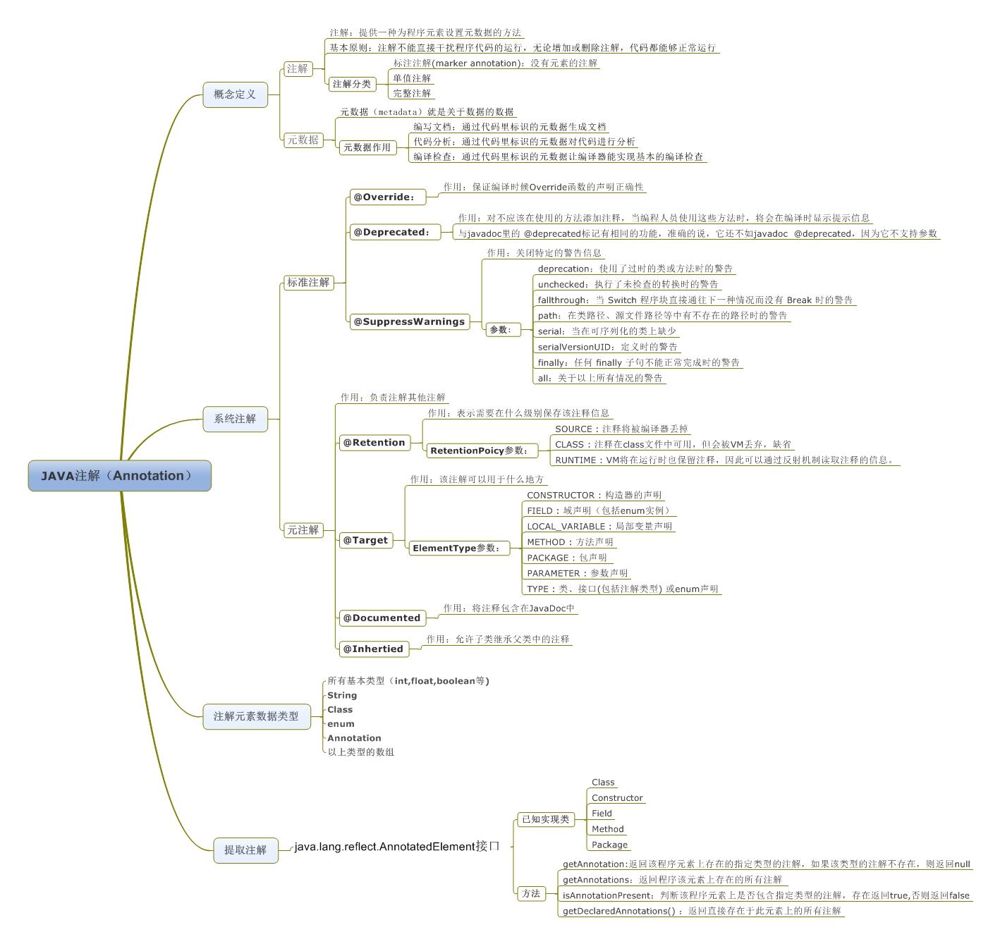

# Java自定义注解开发
开发流程  
> 1、注解声明(可以作用在方法、方法参数、变量...)  
> 2、注解处理器(自定义注解所要处理的业务)  
> 3、注解使用(只要在方法、方法参数、变量等头上加上注解即可)  

参考资料  
* [Java自定义注解及使用场景](https://www.jianshu.com/p/a7bedc771204)
* [Java实现自定义注解开发](https://www.cnblogs.com/DFX339/p/11386722.html)
* [深入理解Java：注解（Annotation）基本概念](https://www.cnblogs.com/peida/archive/2013/04/23/3036035.html)
* [深入理解Java：注解（Annotation）自定义注解入门](https://www.cnblogs.com/peida/archive/2013/04/24/3036689.html)
* [深入理解Java：注解（Annotation）注解处理器](https://www.cnblogs.com/peida/archive/2013/04/26/3038503.html)

* [spring @Value注解原理梳理及自定义实现@MyValue注解实例](https://blog.csdn.net/mapeng765441650/article/details/105477160/)
* [java注解笔记](https://www.pianshen.com/article/1710239848/)

### 一、为什么要学习注解？学习注解有什么好处？学完能做什么？
* 1、能够读懂别人写的代码，特别是框架相关的代码
* 2、让编程更加简洁，代码更加清晰
* 3、让别人高看一眼

### 二、什么是注解(Annotation)
```
Java注解又称Java标注，是JDK5.0版本开始支持加入源代码的特殊语法元数据。
Java语言中的类、方法、变量、参数和包等都可以被标注。和Javadoc不同，Java标注可以通过反射获取标注内容。
在编译器生成类文件时，标注可以被嵌入到字节码中。Java虚拟机可以保留标注内容，在运行时可以获取到标注内容。 
当然它也支持自定义Java标注。
```
自定义注解详细说明    
了解一下自定义注解的标准示例，注解类使用 @interface 关键字修饰，且在注解类上方声明注解相关信息，包含以下四种信息
* @Documented – 注解是否将包含在JavaDoc中  
* @Retention – 什么时候使用该注解  
* @Target – 注解用于什么地方  
* @Inherited – 是否允许子类继承该注解  

1.) @Retention – 定义该注解的生命周期  
* RetentionPolicy.SOURCE : 在编译阶段丢弃。这些注解在编译结束之后就不再有任何意义，所以它们不会写入字节码。@Override, @SuppressWarnings都属于这类注解。
* RetentionPolicy.CLASS : 在类加载的时候丢弃。在字节码文件的处理中有用。注解默认使用这种方式
* RetentionPolicy.RUNTIME : 始终不会丢弃，运行期也保留该注解，因此可以使用反射机制读取该注解的信息。我们自定义的注解通常使用这种方式。

2.) Target – 表示该注解用于什么地方。默认值为任何元素，表示该注解用于什么地方。可用的ElementType 参数包括
* ElementType.CONSTRUCTOR: 用于描述构造器
* ElementType.FIELD: 成员变量、对象、属性（包括enum实例）
* ElementType.LOCAL_VARIABLE: 用于描述局部变量
* ElementType.METHOD: 用于描述方法
* ElementType.PACKAGE: 用于描述包
* ElementType.PARAMETER: 用于描述参数
* ElementType.TYPE: 用于描述类、接口(包括注解类型) 或enum声明

3.) @Documented – 一个简单的Annotations 标记注解，表示是否将注解信息添加在java 文档中。

4.) @Inherited – 定义该注释和子类的关系  
 @Inherited 元注解是一个标记注解，它阐述了某个被标注的类型是被继承的。
 如果一个使用了@Inherited 修饰的annotation 类型被用于一个class，则这个annotation 将被用于该class 的子类。


### 三、注解(Annotation)


### 四、示例 通过反射获取注解
定义一个注解：【注解声明】  
```java
//【注解声明】  
@Target(ElementType.FIELD)  //注解用于字段上
@Retention(RetentionPolicy.RUNTIME) //保留到运行时，可通过注解获取
public @interface MyField {
    String description();
    int length();
}
```
通过反射获取注解: 【注解处理器】、【注解使用】 
```java
@SpringBootTest
@RunWith(SpringRunner.class)
public class MyFieldTest {
    //使用的自定义注解 【注解使用】 
    @MyField(description = "用户名", length = 12)
    private String username;

    //通过反射获取注解【注解处理器】
    @Test
    public void testMyField(){
        // 获取类模板
        Class c = MyFieldTest.class;
        // 获取所有字段
        for(Field f : c.getDeclaredFields()){
            // 判断这个字段是否有MyField注解
            if(f.isAnnotationPresent(MyField.class)){
                MyField annotation = f.getAnnotation(MyField.class);
                System.out.println("字段:[" + f.getName() + "], 描述:[" + annotation.description() + "], 长度:[" + annotation.length() +"]");
            }
        }
    }
}
```
运行结果
```
字段:[username], 描述:[用户名], 长度:[12]
```

### 五、应用场景：自定义注解+拦截器 实现登录校验
使用springboot拦截器实现这样一个功能，如果方法上加了@LoginRequired，则提示用户该接口需要登录才能访问，否则不需要登录。  
首先定义一个LoginRequired注解
```java
/**
 * @author tangzanyong
 * @description 必须登录注解
 * @date 2020/5/15
 **/
@Target(ElementType.METHOD) //用于描述方法
@Retention(RetentionPolicy.RUNTIME)
public @interface LoginRequired {
}
```
然后写两个简单的接口，访问sourceA，sourceB资源  
```java
@RestController
@RequestMapping("/test")
public class TestController {
    @GetMapping("/sourceA")
    public String sourceA(){
        Dog d = new Dog();
        System.out.println(d);
        return "你正在访问sourceA资源";
    }
    @GetMapping("/sourceB")
    public String sourceB(){
        return "你正在访问sourceB资源";
    }
}
```
没添加拦截器之前都成功访问  


创建实现spring的HandlerInterceptor接口的AccessInterceptor类，实现拦截器，但不拦截，只是简单打印日志，如下：  
```java
public class AccessInterceptor implements HandlerInterceptor {
    @Override
    public boolean preHandle(HttpServletRequest request, HttpServletResponse response, Object handler) throws Exception {
        System.out.println("进入拦截器了");
    }
}
```
创建实现spring的WebMvcConfigurer接口的WebMvcConfig类，作为配置类把拦截器添加到拦截器链中  
```java
@Configuration
public class WebMvcConfig implements WebMvcConfigurer {
    //在实现spring的WebMvcConfigurer配置类中添加拦截器,并把拦截器添加到拦截器链中
    @Override
    public void addInterceptors(InterceptorRegistry registry) {
        //把AccessInterceptor拦截器添加到拦截器链中
        registry.addInterceptor(new AccessInterceptor()).addPathPatterns("/**");//所有路径都被拦截
    }
}
```
拦截成功如下  


在sourceB方法上添加我们的登录注解@LoginRequired, 在sourceA方法上不加   
```java
@RestController
@RequestMapping("/test")
public class TestController {
    @GetMapping("/sourceA")
    @ApiOperation(value = "测试不用登录可以访问资源")
    public String sourceA(){
        return "你正在访问sourceA资源";
    }
    @LoginRequired //必须登录注解，需要登录才能访问该方法
    @GetMapping("/sourceB")
    @ApiOperation(value = "测试 必须登录注解，需要登录才能访问的资源")
    public String sourceB(){
        return "你正在访问sourceB资源";
    }
}
```
简单实现登录拦截逻辑  
```java
public class AccessInterceptor implements HandlerInterceptor {
    @Override
    public boolean preHandle(HttpServletRequest request, HttpServletResponse response, Object handler) throws Exception {
        System.out.println("进入拦截器了");

        // 反射获取方法上的LoginRequred注解
        // 当springboot1.x升级到springboot2.x，会抛异常java.lang.ClassCastException: org.springframework.web.servlet.resource.ResourceHttpRequestHandler cannot be cast to org.springframework.web.method.HandlerMethod
        // 因为springboot2.x 对静态资源也进行了拦截，当拦截器拦截到请求之后，但controller里并没有对应的请求时，该请求会被当成是对静态资源的请求。此时的handler就是 ResourceHttpRequestHandler，就会抛出上述错误。
        if(handler instanceof HandlerMethod){
            HandlerMethod handlerMethod = (HandlerMethod)handler;
            LoginRequired loginRequired = handlerMethod.getMethod().getAnnotation(LoginRequired.class);
            if(loginRequired == null){ //不需要登录
                return true;
            }
            // 有LoginRequired注解说明需要登录，提示用户登录
            response.setContentType("application/json; charset=utf-8");
            response.getWriter().print("你访问的资源需要登录");
            return false;
        }else if(handler instanceof ResourceHttpRequestHandler){ //spring boot 2.0对静态资源也进行了拦截，当拦截器拦截时放行
            return true;
        }
        return false;
    }
}
```
运行成功，访问sourceB时需要登录了，访问sourceA则不用登录  


### 六、应用场景：自定义注解+AOP 实现日志打印
先导入切面需要的依赖包  
```xml
        <dependency>
            <groupId>org.springframework.boot</groupId>
            <artifactId>spring-boot-starter-aop</artifactId>
        </dependency>
```

定义一个日志注解@SysLog
```j
@Target(ElementType.METHOD) //用于描述方法
@Retention(RetentionPolicy.RUNTIME) //保留到运行时，可通过注解获取
public @interface SysLog {

}
```
定义一个切面类，见如下代码注释理解：  
```java
@Aspect // 1.表明这是一个切面类
@Component
public class SysLogAspect {
    // 2. PointCut表示这是一个切点，@annotation表示这个切点切到一个注解上，后面带该注解的全类名
    // 切面最主要的就是切点，所有的故事都围绕切点发生
    // logPointCut()代表切点名称
    @Pointcut("@annotation(com.tzy.demo.annotation.logger.SysLog)")
    public void logPointCut(){};

    // 3. 环绕通知
    @Around("logPointCut()")
    public Object logAround(ProceedingJoinPoint joinPoint) {
        Object result = null;
        // 获取方法名称
        String methodName = joinPoint.getSignature().getName();
        // 获取入参
        Object[] param = joinPoint.getArgs();

        StringBuilder sb = new StringBuilder();
        for (Object o : param) {
            sb.append(o + "; ");
        }
        System.out.println("进入[" + methodName + "]方法,参数为:" + sb.toString());

        // 继续执行方法
        try {
            result = joinPoint.proceed();
        } catch (Throwable throwable) {
            throwable.printStackTrace();
        }
        System.out.println(methodName + "方法执行结束");
        return result;
    }
}
```
在TestController写一个sourceC进行测试，加上我们的自定义注解：
```java
@RestController
@RequestMapping("/test")
public class TestController {
    @SysLog //加了日志注解
    @GetMapping("/sourceC/{source_name}")
    @ApiOperation(value = "测试 日志注解，调用该接口，会打出日志")
    public String sourceC(@PathVariable("source_name") String sourceName){
        return "你正在访问sourceC资源";
    }
}    
```
启动项目，输入访问地址  


