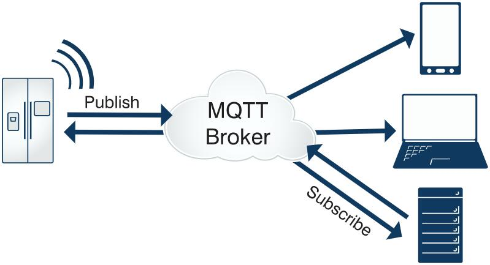
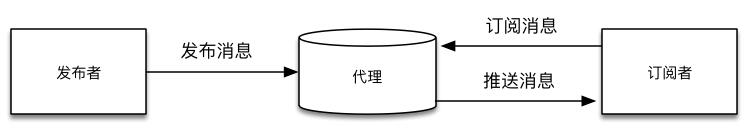
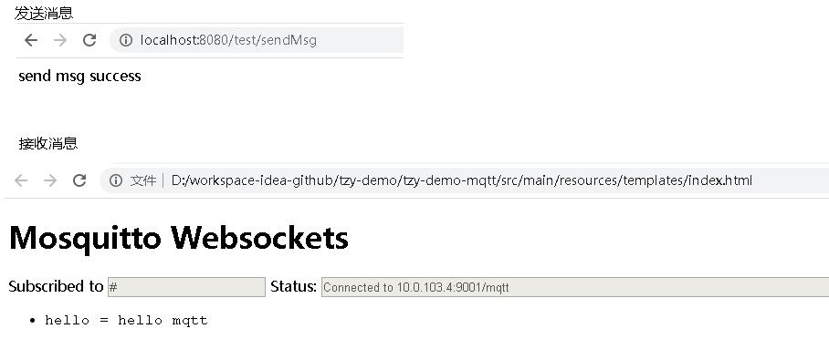
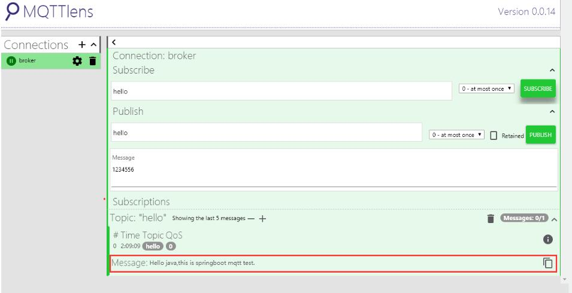
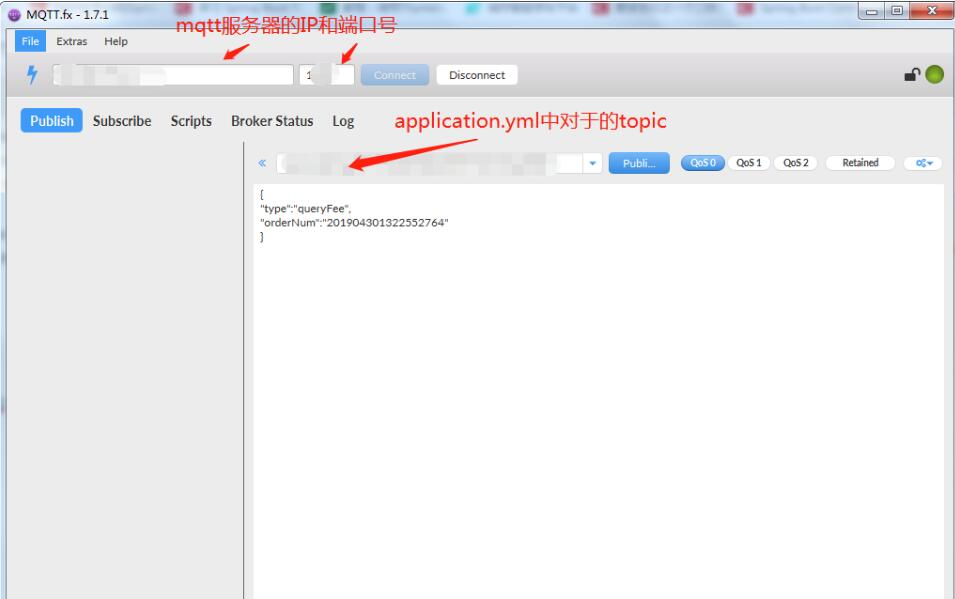
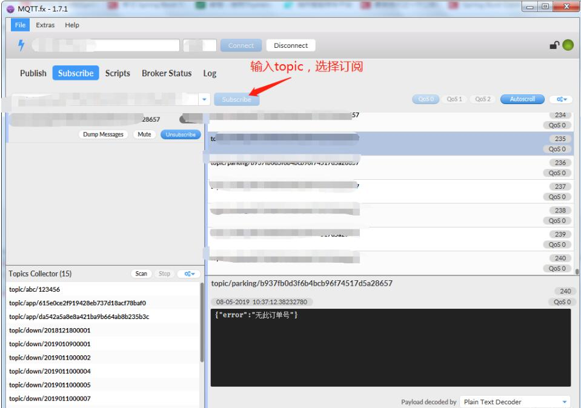

# MQTT与springboot2.x整合mqtt
### 一、MQTT概述
* 1、MQTT是一个基于客户端-服务器的消息发布/订阅传输协议(消息队列遥测传输)  
* 2、MQTT协议是为大量计算能力有限，且工作在低带宽、不可靠的网络的远程传感器和控制设备通讯而设计的协议，可以说是为物联网而生。 
* 3、MQTT协议是构建于TCP/IP协议上
* 4、实现MQTT协议的中间件有EMQTT、Mosquitto、Apache-Apollo等
 

参考资料  
* [MQTT入门](https://www.runoob.com/w3cnote/mqtt-intro.html)
* [HTTP、MQTT、Websocket、WebService有什么区别](https://blog.csdn.net/wzhqazcscs/article/details/79603261)
* [MQTT和WebSocket](https://www.cnblogs.com/ghj1976/p/3773981.html)

### 二、MQTT示例及SpringBoot2.x整合MQTT 
一个完整的MQTT示例包括一个代理器，一个发布者和一个订阅者  

步骤  
> 1、【代理器】安装一台基于MQTT协议的服务器 如：Mosquitto  
> 2、【发布者】SpringBoot整合Mqtt后，发消息到Mosquitto服务器上    
> 3、【订阅者】设备上(测试可以用浏览器代替)配置Mosquitto服务器信息，用于查看消息    

参考资料  
* [Mosquitto 搭建及配置](https://www.jianshu.com/p/9e3cb7042a2e)
* [Mosquitto安装配置和使用指南](https://blog.csdn.net/lclfans1983/article/details/105694696/)
* [SpringBoot2.0集成MQTT功能之消息订阅处理](https://blog.csdn.net/wzhqazcscs/article/details/79603261)
* [基于netty+mqtt 3.1.1协议开发的物联网消息推送框架。](https://gitee.com/duwang1104/iot_push)

#### SpringBoot2.x整合MQTT 
1.) pom.xml配置：
```xml
    <dependency>
        <groupId>org.springframework.integration</groupId>
        <artifactId>spring-integration-stream</artifactId>
    </dependency>
    <dependency>
       <groupId>org.springframework.integration</groupId>
       <artifactId>spring-integration-mqtt</artifactId>
    </dependency>
```

2.) 配置MQTT服务器基本信息，在springBoot配置文件application.yml中配置
```yaml
spring:
  mqtt: #MQTT配置信息
    username: null #MQTT-用户名
    password: null #MQTT-密码
    url: tcp://10.0.103.4:1883 #MQTT-服务器连接地址，如果有多个，用逗号隔开，如：tcp://127.0.0.1:61613，tcp://192.168.2.133:61613
    client:
      id: ${random.value} #MQTT-连接服务器默认客户端ID
    default:
      topic: topic #MQTT-默认的消息推送主题，实际可在调用接口时指定
    completionTimeout: 3000
```

3.) MQTT推送消息类  
```java
@Configuration
@IntegrationComponentScan
public class MqttSenderConfig {
    @Value("${spring.mqtt.username}")
    private String username;

    @Value("${spring.mqtt.password}")
    private String password;

    @Value("${spring.mqtt.url}")
    private String hostUrl;

    @Value("${spring.mqtt.client.id}")
    private String clientId;

    @Value("${spring.mqtt.completionTimeout}")
    private int completionTimeout;   //连接超时

    //    @Value("${spring.mqtt.default.topic}")
    private String defaultTopic = "#";

    @Bean
    public MqttConnectOptions getMqttConnectOptions(){
        MqttConnectOptions mqttConnectOptions=new MqttConnectOptions();
        mqttConnectOptions.setCleanSession(true);
        mqttConnectOptions.setConnectionTimeout(10);
        mqttConnectOptions.setKeepAliveInterval(90);
        mqttConnectOptions.setAutomaticReconnect(true);
        mqttConnectOptions.setUserName(username);
        mqttConnectOptions.setPassword(password.toCharArray());
        mqttConnectOptions.setServerURIs(new String[]{hostUrl});
        mqttConnectOptions.setKeepAliveInterval(2);
        return mqttConnectOptions;
    }
    @Bean
    public MqttPahoClientFactory mqttClientFactory() {
        DefaultMqttPahoClientFactory factory = new DefaultMqttPahoClientFactory();
        factory.setConnectionOptions(getMqttConnectOptions());
        return factory;
    }
    @Bean
    @ServiceActivator(inputChannel = "mqttOutboundChannel")
    public MessageHandler mqttOutbound() {
        MqttPahoMessageHandler messageHandler =  new MqttPahoMessageHandler(clientId, mqttClientFactory());
        messageHandler.setAsync(true);
        messageHandler.setDefaultTopic(defaultTopic);
        return messageHandler;
    }
    @Bean
    public MessageChannel mqttOutboundChannel() {
        return new DirectChannel();
    }
}
```
4.) MQTT推送订阅类     
```java
@Configuration
@IntegrationComponentScan
@Slf4j
public class MqttReceiveConfig {
    @Value("${spring.mqtt.username}")
    private String username;

    @Value("${spring.mqtt.password}")
    private String password;

    @Value("${spring.mqtt.url}")
    private String hostUrl;

    @Value("${spring.mqtt.client.id}")
    private String clientId;

    @Value("${spring.mqtt.completionTimeout}")
    private int completionTimeout;   //连接超时

    //    @Value("${spring.mqtt.default.topic}")
    private String defaultTopic = "#";

    @Autowired
    private MqttGateway mqttGateway;
    
    @Bean
    public MqttConnectOptions getMqttConnectOptions(){
        MqttConnectOptions mqttConnectOptions=new MqttConnectOptions();
        mqttConnectOptions.setCleanSession(true);
        mqttConnectOptions.setConnectionTimeout(10);
        mqttConnectOptions.setKeepAliveInterval(90);
        mqttConnectOptions.setAutomaticReconnect(true);
        mqttConnectOptions.setUserName(username);
        mqttConnectOptions.setPassword(password.toCharArray());
        mqttConnectOptions.setServerURIs(new String[]{hostUrl});
        mqttConnectOptions.setKeepAliveInterval(2);
        return mqttConnectOptions;
    }
    @Bean
    public MqttPahoClientFactory mqttClientFactory() {
        DefaultMqttPahoClientFactory factory = new DefaultMqttPahoClientFactory();
        factory.setConnectionOptions(getMqttConnectOptions());
        return factory;
    }

    //接收通道
    @Bean
    public MessageChannel mqttInputChannel() {
        return new DirectChannel();
    }

    //配置client,监听的topic
    @Bean
    public MessageProducer inbound() {
        MqttPahoMessageDrivenChannelAdapter adapter =
                new MqttPahoMessageDrivenChannelAdapter(clientId+"_inbound", mqttClientFactory(),
                        defaultTopic);
        adapter.setCompletionTimeout(completionTimeout);
        adapter.setConverter(new DefaultPahoMessageConverter());
        adapter.setQos(1);
        adapter.setOutputChannel(mqttInputChannel());
        return adapter;
    }

    //通过通道获取数据
    @Bean
    @ServiceActivator(inputChannel = "mqttInputChannel")
    public MessageHandler handler() {
        return new MessageHandler() {
            @Override
            public void handleMessage(Message<?> message) throws MessagingException {
                log.info("主题：{}，消息接收到的数据：{}", message.getHeaders().get("mqtt_receivedTopic"), message.getPayload());
            }
        };
    }
```
5.) MQTT推送消息类和订阅类可以合并在一起
```java
@Configuration
@IntegrationComponentScan
public class MqttConfig {

    private final Log log = LogFactory.getLog(getClass());

    @Value("${spring.mqtt.username}")
    private String username;

    @Value("${spring.mqtt.password}")
    private String password;

    @Value("${spring.mqtt.url}")
    private String hostUrl;

    @Value("${spring.mqtt.client.id}")
    private String clientId;

    @Value("${spring.mqtt.completionTimeout}")
    private int completionTimeout;   //连接超时

    //    @Value("${spring.mqtt.default.topic}")
    private String defaultTopic = "#";


    @Bean
    public MqttConnectOptions getMqttConnectOptions() {
        MqttConnectOptions mqttConnectOptions = new MqttConnectOptions();
        mqttConnectOptions.setUserName(username);
        mqttConnectOptions.setPassword(password.toCharArray());
        mqttConnectOptions.setServerURIs(new String[]{hostUrl});
        mqttConnectOptions.setKeepAliveInterval(2);
        return mqttConnectOptions;
    }

    @Bean
    public MqttPahoClientFactory mqttClientFactory() {
        DefaultMqttPahoClientFactory factory = new DefaultMqttPahoClientFactory();
        factory.setConnectionOptions(getMqttConnectOptions());
        return factory;
    }

    //推送通道
    @Bean
    public MessageChannel mqttOutboundChannel() {
        return new DirectChannel();
    }
    //推送通道配置
    @Bean
    @ServiceActivator(inputChannel = "mqttOutboundChannel")
    public MessageHandler mqttOutbound() {
        MqttPahoMessageHandler messageHandler = new MqttPahoMessageHandler(clientId, mqttClientFactory());
        messageHandler.setAsync(true);
        messageHandler.setDefaultTopic(defaultTopic);
        return messageHandler;
    }

    //配置client,监听的topic
    @Bean
    public MessageProducer inbound() {
        MqttPahoMessageDrivenChannelAdapter adapter =
                new MqttPahoMessageDrivenChannelAdapter(clientId + "_inbound", mqttClientFactory(),
                        "#", "user", "hello1");
        adapter.setCompletionTimeout(completionTimeout);
        adapter.setConverter(new DefaultPahoMessageConverter());
        adapter.setQos(1);
        adapter.setOutputChannel(mqttInputChannel());
        return adapter;
    }

    //接收通道
    @Bean
    public MessageChannel mqttInputChannel() {
        return new DirectChannel();
    }

    //通过通道获取数据
    @Bean
    @ServiceActivator(inputChannel = "mqttInputChannel")
    public MessageHandler handler() {
        return new MessageHandler() {
            @Override
            public void handleMessage(Message<?> message) throws MessagingException {
                //TODO 此处可订阅到所有同个client通道信息
                log.info("主题：" + message.getHeaders().get("mqtt_receivedTopic").toString());
                log.info("本次收到内容:" + message.getPayload().toString());
            }
        };
    }
}
```
6.) 配置MqttGateway消息推送接口类，在sendToMqtt(String data,@Header(MqttHeaders.TOPIC)String topic)接口中，data为发送的消息内容，topic为主题。指定topic，则我们的接口可以根据需要，向不同的主题发送消息，方便灵活应用。如果不指定，则使用默认配置的主题。
```java
@MessagingGateway(defaultRequestChannel = "mqttOutboundChannel")
public interface MqttGateway {
    /**
     * 定义重载方法，用于消息发送
     */
    void sendToMqtt(String data);
    /**
     * 指定topic发送
     */
    void sendToMqtt(@Header(MqttHeaders.TOPIC) String topic, String data);
    /**
     * 指定topic与等级进行消息发送
     *
     *  【QOS】:
     *      0代表“至多一次”，消息发布完全依赖底层 TCP/IP 网络。会发生消息丢失或重复。这一级别可用于如下情况，环境传感器数据，丢失一次读记录无所谓，因为不久后还会有第二次发送。
     *      1代表“至少一次”，确保消息到达，但消息重复可能会发生。
     *      2代表“只有一次”，确保消息到达一次。这一级别可用于如下情况，在计费系统中，消息重复或丢失会导致不正确的结果。
     *
     */
    void sendToMqtt(@Header(MqttHeaders.TOPIC) String topic, @Header(MqttHeaders.QOS) int qos, String data);
}
```

7.) 测试
```java
@RestController
@RequestMapping("/test")
public class TestController {
    @Resource
    private MqttGateway mqttGateway;

    @GetMapping("/sendMsg")
    public String sendMsg(){
        //发送hello主题的消息
        mqttGateway.sendToMqtt("hello",1, "hello mqtt");
        return "send msg success";
    }
}
```


也可以使用MQTTLens订阅hello主题，从下面截图，可以看出可以正常往MQTT服务发送消息了，而且可以订阅到。


也可以使用的是MQTT.fx工具 



### 三、其它 
[基于netty+springboot+jdk8实现的mqtt3.1.1协议的服务端跟客户端](https://gitee.com/duwang1104/iot_push)

