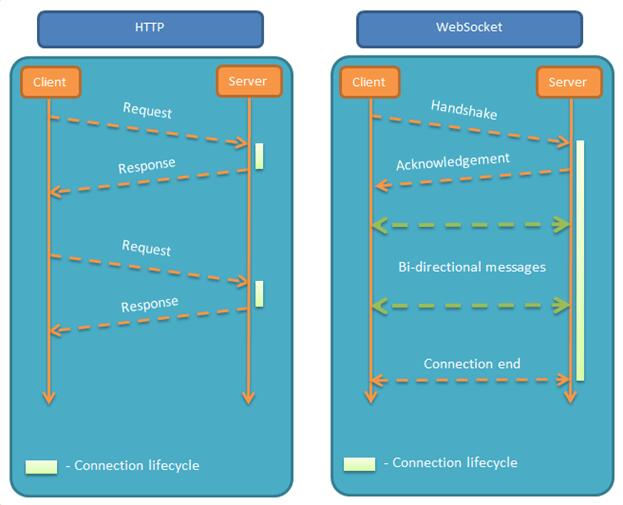
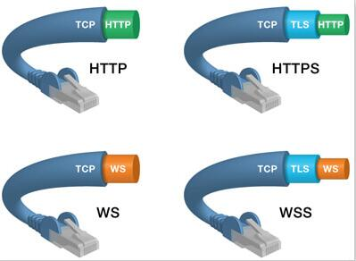

# WebSocket
### 一、概述
* 1、WebSocket是一种在单个TCP连接上进行全双工通信的协议。同HTTP一样也是应用层的协议，但是它是一种双向通信协议，是建立在TCP之上的。  
* 2、WebSocket是应用层协议，而Socket是传输控制层协议 
* 3、Websocket是一个持久化的协议，相对于HTTP这种非持久的协议来说

WebSocket最大特点就是，服务器可以主动向客户端推送信息，客户端也可以主动向服务器发送信息，是真正的双向平等对话，属于服务器推送技术的一种。  

协议标识符是ws（如果加密，则为wss），如：ws://example.com:80/some/path        


参考资料  
* [HTML5 WebSocket](https://www.runoob.com/html/html5-websocket.html)
* [WebSocket介绍和Socket的区别](https://blog.csdn.net/wwd0501/article/details/54582912)


### 二、为什么需要WebSocket？
```
已经有了HTTP协议，为什么还需要WebSocket协议  
因为 HTTP 协议有一个缺陷：通信只能由客户端发起。  
举例来说，我们想了解今天的天气，只能是客户端向服务器发出请求，服务器返回查询结果。HTTP 协议做不到服务器主动向客户端推送信息。要实现服务器主动向客户端推送信息，从而出现了WebSocket  

```


